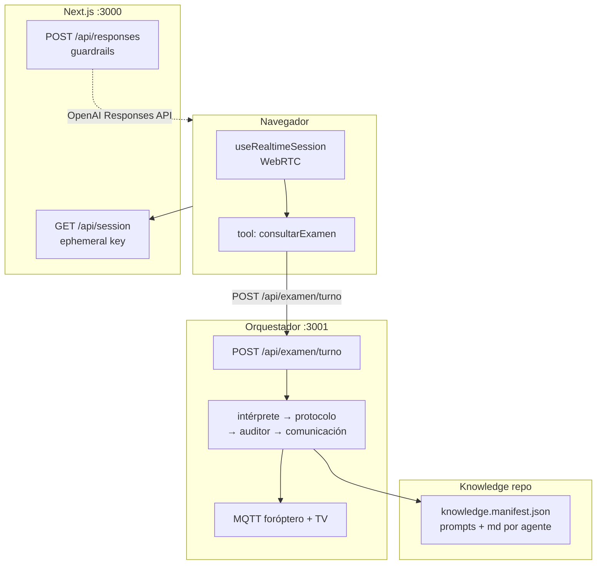

# Arquitectura del sistema — foróptero AI Agent v2

**Estado:** PoC activo — Fase 1: agudeza visual monocular (ojo R → L)  
**Última actualización:** 2026-05-28

> Este es el documento de entrada al sistema. Explica qué hace cada componente, cómo se conectan y dónde encontrar más detalle.

---

## Síntesis

El sistema conduce un examen de agudeza visual por voz. Un **agente de voz** (OpenAI Realtime) conversa con el paciente en tiempo real; delega toda la lógica clínica a un **orquestador** (Express + 4 agentes LLM) que mantiene el estado del examen, decide qué mostrar en pantalla y qué configurar en el foróptero (vía MQTT). Los prompts y el conocimiento clínico viven en un **repositorio externo** versionado.

---

## Diagrama

```
┌─────────────────────────────────────────────────────────────────┐
│  Navegador (cliente)                                            │
│  useRealtimeSession ──WebRTC──► OpenAI Realtime API             │
│       │                                                         │
│       └── tool: consultarExamen ──► POST /api/examen/turno ─►  │
└─────────────────────────────────────────────────────────────────┘
         ▲                                    │
         │ ephemeral key                      ▼
┌────────┴──────────┐        ┌────────────────────────────────────┐
│  Next.js :3000    │        │  Orquestador :3001                 │
│  GET /api/session │        │  pipelineTurno.js                  │
│  POST /api/responses       │  intérprete → protocolo → auditor  │
│  (guardrails)     │        │    → comunicación                  │
└───────────────────┘        │  ejecutarAcciones.js               │
                             │    → MQTT → foróptero + TV         │
                             └──────────────┬─────────────────────┘
                                            │ git pull / reload
                                            ▼
                             ┌──────────────────────────────────┐
                             │  Knowledge repo (externo)         │
                             │  knowledge.manifest.json          │
                             │  prompts/ + knowledge/ por agente │
                             └──────────────────────────────────┘
```



---

## Componentes

### 1. Frontend Realtime (`src/`)

Aplicación Next.js 15. Responsabilidades:

- Establecer sesión WebRTC con OpenAI Realtime API.
- Exponer al agente de voz una única herramienta (`consultarExamen`) que llama al orquestador.
- Mostrar transcript, eventos y estado de guardrails en la UI.
- Aplicar guardrail de output (clasifica contenido ofensivo/fuera de contexto) vía `POST /api/responses`.

**Agente de voz:** `chatSupervisor` — "Oftalmólogo Virtual". Recibe del orquestador `{ ok, pasos, contextoVoz }` y pronuncia los mensajes. No tiene lógica clínica propia.

| Archivo clave | Rol |
|---------------|-----|
| `src/app/agentConfigs/chatSupervisor/index.ts` | Definición del agente + tool `consultarExamen` |
| `src/app/hooks/useRealtimeSession.ts` | Ciclo de vida de la sesión Realtime |
| `src/app/lib/turnoPaciente.ts` | Estado STT + timestamp de idempotencia por turno |
| `src/app/lib/examenTurnoClient.ts` | HTTP POST con reintentos al orquestador |
| `src/app/api/session/route.ts` | Genera ephemeral key de Realtime |
| `src/app/api/responses/route.ts` | Proxy guardrail → OpenAI Responses API |

**Modelo Realtime:** `gpt-realtime-mini-2025-12-15`  
**Modelo guardrails:** `gpt-4o-mini`

---

### 2. Orquestador (`reference/foroptero-orchestrator/`)

Servicio Express independiente. Responsabilidades:

- Recibir turnos del frontend (`POST /api/examen/turno`).
- Ejecutar el **pipeline de 4 agentes LLM** por turno.
- Mantener el estado del examen en memoria.
- Enviar comandos a dispositivos físicos (foróptero + TV) vía MQTT.
- Cargar prompts y knowledge desde el repositorio externo en startup.

**Pipeline por turno (`modo: respuesta`):**

```
intérprete
  → registro de intento (servidor, tabla resultadosPorLogmar)
    → protocolo (hasta 1 reintento con feedback del auditor)
      → auditor (aprueba/rechaza propuesta del protocolo)
        → comunicación
          → ejecutarAcciones (MQTT)
```

**Turno bootstrap (`modo: bootstrap`):** cuando el ojo activo no tiene `letraActual` ni `logmarActual`, el intérprete se omite y protocolo + auditor arrancan el ojo desde H@0.3.

| Archivo clave | Rol |
|---------------|-----|
| `server.js` | Servidor HTTP + MQTT + endpoints |
| `pipelineTurno.js` | Orquestación del pipeline por turno |
| `orquestadorExamen.js` | Entry point por turno |
| `estadoExamen.js` | Estado en memoria + historial |
| `ejecutarAcciones.js` | Traducción de patch → MQTT |
| `agents/{interprete,protocolo,auditor,comunicacion}.js` | Llamadas LLM por rol |
| `lib/vistasAgentes.js` | Proyección de estado → vista mínima por agente |
| `lib/registroAgudeza.js` | Tabla `resultadosPorLogmar` |
| `lib/knowledge.js` | Carga del manifest externo |

---

### 3. Repositorio de conocimiento (`reference/Oftalm_agent_v2_prompts_knowledge/`)

Repositorio git externo (`digifab-ar/Oftalm_agent_v2_prompts_knowledge`). El orquestador lo clona en startup y puede recargarlo sin redeploy via webhook o endpoint admin.

Contiene:
- `prompts/` — system prompts por agente (auditor, intérprete, protocolo, comunicación)
- `knowledge/core/` — reglas cross-fase (auditoría estructural, comunicación común, interpretación)
- `knowledge/fases/agudeza/` — reglas clínicas de la fase actual
- `meta-agent/` — agente offline para definir y optimizar exámenes

El índice es `knowledge.manifest.json`: mapea agente × fase → archivos a inyectar en el system prompt.

---

## Variables de entorno

### Frontend (`.env.local`)

| Variable | Descripción | Requerida |
|----------|-------------|-----------|
| `OPENAI_API_KEY` | Clave API para `/api/session` y `/api/responses` | Sí |
| `NEXT_PUBLIC_FOROPTERO_ORCHESTRATOR_URL` | URL base del orquestador (default: `http://localhost:3001`) | Sí |

### Orquestador (`.env` en `reference/foroptero-orchestrator/`)

| Variable | Descripción | Requerida |
|----------|-------------|-----------|
| `OPENAI_API_KEY` | Clave API para agentes LLM | Sí |
| `PORT` | Puerto HTTP (default: `3001`) | No |
| `KNOWLEDGE_ROOT` | Ruta al repo de knowledge clonado | No (auto-detecta hermano) |
| `KNOWLEDGE_GIT_URL` | URL del repo para clone automático | No |
| `KNOWLEDGE_GIT_REF` | Branch/tag a usar (default: `main`) | No |
| `KNOWLEDGE_RELOAD_TOKEN` | Token para recarga manual | Prod |
| `KNOWLEDGE_GITHUB_WEBHOOK_SECRET` | Secret del webhook GitHub | Prod |

---

## Inicio rápido

```bash
# 1. Orquestador
cd reference/foroptero-orchestrator
cp .env.example .env          # editar OPENAI_API_KEY
npm install
npm start                     # escucha en :3001

# 2. Frontend (raíz del repo)
# Crear .env.local con OPENAI_API_KEY y NEXT_PUBLIC_FOROPTERO_ORCHESTRATOR_URL
npm install
npm run dev                   # escucha en :3000
```

---

## Cómo leer más

| Tema | Documento |
|------|-----------|
| Frontend Realtime en detalle | [REALTIME.md](./REALTIME.md) |
| Pipeline de agentes en detalle | [ORQUESTADOR.md](./ORQUESTADOR.md) |
| Repositorio de knowledge | [KNOWLEDGE.md](./KNOWLEDGE.md) |
| Endpoints y contratos API | [API.md](./API.md) |
| Diseño original completo (PoC) | [reference/DISENO_AGENTE_INTERMEDIO.md](../reference/DISENO_AGENTE_INTERMEDIO.md) |
| Historial de planes implementados | [historial/](./historial/) |
