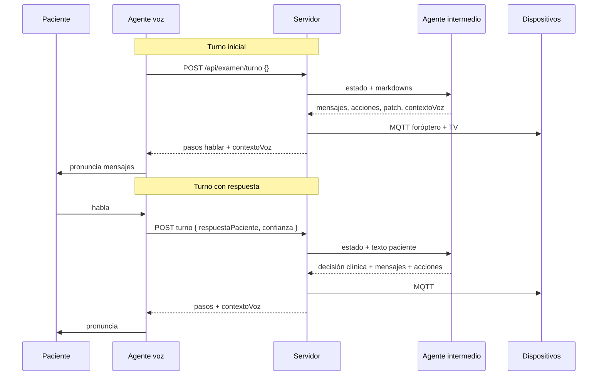

# Diseño — Agente intermedio de examen visual (POC)

**Versión:** 0.1 (borrador acordado)  
**Fecha:** 2026-05-15  
**Estado:** Implementado (POC fase agudeza) — ver `reference/foroptero-orchestrator/`  

Este documento consolida las definiciones acordadas para evolucionar el sistema de examen visual: reemplazar la lógica determinista de `motorExamen.js` por un **agente intermedio** (LLM) con conocimiento en markdown, desplegado en un **servidor nuevo**, conectado al **agente de voz** (OpenAI Realtime) y a **dispositivos** (foróptero + TV vía MQTT).

---

## Tabla de contenidos

1. [Objetivo](#1-objetivo)
2. [Contexto del sistema actual](#2-contexto-del-sistema-actual)
3. [Principios de diseño](#3-principios-de-diseño)
4. [Arquitectura objetivo](#4-arquitectura-objetivo)
5. [Roles de los agentes](#5-roles-de-los-agentes)
6. [Contrato API (Realtime ↔ servidor)](#6-contrato-api-realtime--servidor)
7. [Agente intermedio (orquestador)](#7-agente-intermedio-orquestador)
8. [Agente de voz (Realtime)](#8-agente-de-voz-realtime)
9. [Estado y resultados](#9-estado-y-resultados)
10. [Conocimiento en markdown](#10-conocimiento-en-markdown)
11. [Dispositivos (foróptero y TV)](#11-dispositivos-foróptero-y-tv)
12. [Modelos de lenguaje](#12-modelos-de-lenguaje)
13. [Despliegue](#13-despliegue)
14. [Plan de implementación](#14-plan-de-implementación)
15. [QA y riesgos](#15-qa-y-riesgos)
16. [Roadmap de scope](#16-roadmap-de-scope)
17. [Glosario](#17-glosario)

---

## 1. Objetivo

### 1.1 Objetivo general

Construir una **POC** donde la lógica del examen visual la define un **agente intermedio** (prompt + markdowns), en lugar de la máquina de estados de `reference/foroptero-server/motorExamen.js`.

El agente intermedio:

- Analiza la **respuesta del paciente** (texto libre + confianza de captura).
- Mantiene y actualiza el **estado del examen** en el servidor.
- **Redacta** los mensajes que el paciente escuchará.
- Ordena **acciones** sobre foróptero y TV (ejecutadas por el servidor vía MQTT).

El agente de voz:

- Conversa en tiempo real.
- Envía al servidor lo que dijo el paciente (sin clasificación clínica estructurada).
- **Pronuncia textualmente** los mensajes que devuelve el intermedio.

### 1.2 Objetivo de la fase 1 (MVP)

| Incluido | Excluido (fases posteriores) |
|----------|------------------------------|
| Test de **agudeza visual** monocular (ojo R → ojo L) | Autorefractómetro y recálculo cilíndrico (ETAPA_1–2) |
| Escalera logMAR desde **0.3** (definida en markdown) | Tests de lentes (ETAPA_5) |
| RX de arranque **fija** (markdown / servidor) | Examen binocular (ETAPA_6) |
| Registro en servidor + API de consulta | Modos de prueba (`testesf`, `testcil`, `testbin`) |
| QA manual clínico | Persistencia de sesión entre reinicios |
| | Feature flag / convivencia con motor en mismo deploy |

### 1.3 Definiciones acordadas (fase 1)

- **RX inicial:** valores fijos en markdown/servidor por ahora; más adelante el operador/paciente los cargará por **chat en la UI Realtime**.
- **Agudeza:** solo **escalera desde logMAR 0.3** (letra inicial típica **H**); reglas en `examen-agudeza.md`.
- **Validación clínica:** solo **LLM** (prompt + markdown); sin capa validadora determinista en código por ahora.
- **Límites absolutos** (dioptrías, ángulos, etc.): definidos en markdown para el LLM, no en código en esta POC.
- **Un examen global** en memoria por instancia del servidor.
- **Latencia objetivo:** ~3 s por turno (POC; optimizar después).

---

## 2. Contexto del sistema actual

### 2.1 Componentes existentes

```
Frontend (Next.js + OpenAI Realtime)
    → POST /api/examen/instrucciones  (tool obtenerEtapa)
        → server.js (Railway producción)
            → motorExamen.js (state machine ~4000 líneas)
            → MQTT → Foróptero + TV
```

| Archivo | Rol |
|---------|-----|
| `src/app/agentConfigs/chatSupervisor/index.ts` | Agente de voz; interpreta agudeza/comparación; llama al backend |
| `reference/foroptero-server/server.js` | HTTP, MQTT, endpoints de examen y dispositivos |
| `reference/foroptero-server/motorExamen.js` | Lógica clínica, estado, generación de pasos, ejecución automática de dispositivos |

### 2.2 Dónde vive el estado hoy

| Dato | Ubicación | Persistencia |
|------|-----------|--------------|
| Estado del examen (etapas, resultados, secuencia) | `motorExamen.js` → `estadoExamen` | Memoria (se pierde al reiniciar) |
| Registro CSV / eventos | `motorExamen.js` → `registroExamenEventos` | Memoria |
| Estado foróptero / TV | `server.js` | Memoria + MQTT |

`server.js` **no** define lógica clínica; es nexo HTTP/MQTT.

### 2.3 Por qué cambiar

- Mantener protocolo clínico en JS es costoso (~4000 líneas, muchos edge cases).
- El protocolo en runtime lo gobiernan los markdowns en `reference/foroptero-orchestrator/knowledge/`, no el motor legado en JS.
- La POC busca **flexibilidad** y edición de protocolo vía markdown por el mismo equipo (sin versionado formal ni aprobación previa al deploy).

---

## 3. Principios de diseño

1. **Separación clara:** voz = captura + TTS; intermedio = protocolo + estado + dispositivos + redacción.
2. **Contrato genérico en el borde:** `respuestaPaciente` + `confianza` (no enums clínicos desde Realtime).
3. **Contexto mínimo para la voz:** `contextoVoz` como string de modo (vocabulario cerrado), no objeto clínico.
4. **Estado estructurado en el servidor:** el LLM devuelve patches JSON; el servidor aplica y persiste en memoria.
5. **Mensajes al paciente:** los redacta el intermedio según markdown; la voz los dice **sin modificar**.
6. **Un solo agente intermedio** por ahora (no multi-agente especializado).
7. **Servidor nuevo en Railway:** sin feature flag; el frontend apunta a la URL nueva cuando esté listo.
8. **POC:** priorizar iteración y QA clínico manual sobre determinismo y persistencia.

---

## 4. Arquitectura objetivo

### 4.1 Diagrama

```
┌─────────────────────────────────────────────────────────────┐
│  Frontend Next.js                                           │
│  ┌─────────────────────────────────────────────────────┐   │
│  │ Agente de voz (OpenAI Realtime)                      │   │
│  │  - Escucha / habla                                   │   │
│  │  - Tool: consultarExamen(respuestaPaciente, confianza)│   │
│  └──────────────────────────┬──────────────────────────┘   │
└─────────────────────────────┼───────────────────────────────┘
                              │ HTTPS
                              ▼
┌─────────────────────────────────────────────────────────────┐
│  Nuevo servidor Railway (foroptero-orchestrator)            │
│  ┌──────────────┐  ┌─────────────────┐  ┌───────────────┐  │
│  │  server.js   │→ │ orquestador     │→│ estadoExamen  │  │
│  │  HTTP + MQTT │  │ Examen.js       │  │ .js (memoria) │  │
│  └──────┬───────┘  │ + OpenAI API    │  └───────────────┘  │
│         │          │ + markdowns     │                     │
│         │          └─────────────────┘                     │
└─────────┼───────────────────────────────────────────────────┘
          │ MQTT
          ▼
   ┌──────────────┐     ┌──────────────┐
   │  Foróptero   │     │  TV /        │
   │  (ESP32)     │     │  optotipos   │
   └──────────────┘     └──────────────┘
```

### 4.2 Flujo por turno



### 4.3 Relación con el sistema legado

| Sistema | Uso durante POC |
|---------|-----------------|
| `foroptero-production` (motor actual) | Puede seguir en producción; **no** se modifica para esta POC |
| Nuevo orchestrator | Desarrollo y QA de agudeza con agente intermedio |
| Frontend | Cambia URL de la tool y prompt de voz cuando se integre |

---

## 5. Roles de los agentes

### 5.1 Agente de voz (Realtime)

| Hace | No hace |
|------|---------|
| Mantener conversación natural en español argentino | Decidir logMAR, letras, oclusión, RX |
| Transcribir / parafrasear mínimamente lo que dijo el paciente | Enviar `interpretacionAgudeza` ni otros enums clínicos |
| Llamar al servidor con `respuestaPaciente` + `confianza` | Inventar mensajes al paciente |
| Pronunciar **textualmente** cada `pasos[].mensaje` | Usar `logmarActual` / `ojo` del estado para decisiones |
| Seguir `contextoVoz` (modo de turno) | Validar clínicamente |

### 5.2 Agente intermedio (orquestador LLM)

| Hace | No hace |
|------|---------|
| Leer estado actual + markdowns de protocolo | Escuchar audio |
| Interpretar `respuestaPaciente` en contexto clínico | Hablar directamente con el paciente |
| Actualizar estado (patch estructurado) | Exponer lógica en JS determinista (POC) |
| Redactar `mensajesPaciente` | |
| Emitir `acciones` (foróptero, TV) | |
| Elegir `contextoVoz` para el siguiente comportamiento de la voz | |
| Registrar razonamiento interno para QA (logs / detalle) | |

### 5.3 Servidor (`server.js`)

| Hace | No hace |
|------|---------|
| Recibir HTTP, invocar orquestador | Razonamiento clínico (POC) |
| Aplicar `estadoPatch` en memoria | |
| Ejecutar MQTT (reutilizar patrón del server actual) | |
| Filtrar respuesta al cliente: `pasos` tipo `hablar` + `contextoVoz` | |
| Exponer `GET /estado`, `GET /detalle`, registro para QA | |

---

## 6. Contrato API (Realtime ↔ servidor)

### 6.1 Base URL

- Variable de entorno en frontend: `FOROPTERO_ORCHESTRATOR_URL` (servidor nuevo en Railway).
- El sistema legado (`foroptero-production`) no se usa para esta POC.

### 6.2 Endpoints

| Método | Ruta | Descripción |
|--------|------|-------------|
| `POST` | `/api/examen/nuevo` | Inicializa examen global en memoria |
| `POST` | `/api/examen/turno` | **Turno principal** — voz ↔ intermedio |
| `GET` | `/api/examen/estado` | Resumen para UI / operador |
| `GET` | `/api/examen/detalle` | Snapshot completo + historial (QA) |
| `GET` | `/api/examen/registro.csv` | Export opcional (recomendado para QA) |
| `POST` | `/api/movimiento` | Control manual foróptero (heredado) |
| `GET` | `/api/estado` | Estado MQTT foróptero |
| `POST` | `/api/pantalla` | Control manual TV |
| `GET` | `/api/pantalla` | Estado TV |

### 6.3 `POST /api/examen/nuevo`

Inicializa el examen. En fase 1 la RX puede omitirse (valores demo en markdown).

**Request (fase 1 — opcional):**

```json
{}
```

**Request (futuro — RX por UI/chat):**

```json
{
  "rx": {
    "R": { "esfera": 0.75, "cilindro": -1.75, "angulo": 60 },
    "L": { "esfera": 2.75, "cilindro": 0, "angulo": 0 }
  }
}
```

**Response:**

```json
{
  "ok": true,
  "mensaje": "Examen inicializado"
}
```

### 6.4 `POST /api/examen/turno` (contrato principal)

#### Request

```json
{
  "respuestaPaciente": "creo que es una H, un poco borrosa",
  "confianza": 0.85
}
```

| Campo | Tipo | Obligatorio | Descripción |
|-------|------|-------------|-------------|
| `respuestaPaciente` | `string \| null` | No | Texto libre: lo que el paciente dijo, según el agente de voz. `null` u omitido en arranque o cuando `contextoVoz` indica continuar sin respuesta. |
| `confianza` | `number` (0–1) | No | Confianza del agente de voz en la **captura** (no certeza clínica). Default `1.0` si se omite. |

**Turno inicial / continuar sin paciente:**

```json
{}
```

o, si se estandariza más adelante:

```json
{ "evento": "continuar" }
```

#### Response

```json
{
  "ok": true,
  "pasos": [
    {
      "tipo": "hablar",
      "orden": 1,
      "mensaje": "Mirá la pantalla. Decime qué letra ves."
    }
  ],
  "contextoVoz": "esperar_respuesta",
  "accionesEjecutadas": [
    { "tipo": "foroptero", "ok": true },
    { "tipo": "tv", "letra": "H", "logmar": 0.3, "ok": true }
  ]
}
```

| Campo | Destinatario | Descripción |
|-------|--------------|-------------|
| `pasos` | Agente de voz | Solo pasos `hablar` (dispositivos ya ejecutados en servidor). |
| `contextoVoz` | Agente de voz | Modo de comportamiento del turno siguiente (vocabulario cerrado). |
| `accionesEjecutadas` | UI / logs (opcional) | Confirmación de MQTT; la voz **no** lo necesita en el prompt. |

> **Nota:** El estado clínico estructurado (`ojo`, `logmarActual`, etc.) **no** se envía al agente de voz. Está en `GET /api/examen/estado` y `detalle` para operador y QA.

### 6.5 Tool Realtime (frontend)

**Nombre sugerido:** `consultarExamen` (o mantener `obtenerEtapa` con nueva URL).

**Parámetros:**

```typescript
{
  respuestaPaciente?: string | null;
  confianza?: number | null;  // 0-1
}
```

**Eliminar:** `interpretacionAgudeza`, `interpretacionComparacion`, tablas por etapa en el prompt de voz.

### 6.6 Diseño: contrato genérico vs estructurado

Se eligió **texto libre + confianza** en el borde porque:

- Un solo contrato sirve para agudeza, lentes, RX por chat, etc.
- El intermedio es el único clasificador clínico (alineado con validación solo LLM).
- El prompt de voz se simplifica drásticamente.

**Trade-off:** mayor dependencia de la calidad de transcripción y del orquestador; mitigación con `confianza`, `contextoVoz` estable y registro en `detalle` para QA.

---

## 7. Agente intermedio (orquestador)

### 7.1 Ubicación

Mismo proceso Railway que `server.js` del nuevo servicio (`orquestadorExamen.js`).

### 7.2 Entradas por turno

1. Estado actual (`estadoExamen` resumido — no todo el historial en v1).
2. Contenido de markdowns (`examen-agudeza.md`, `foroptero.md`, `tv.md`).
3. `prompts/sistema.md`.
4. Último turno: `respuestaPaciente`, `confianza` (si aplica).

### 7.3 Salida estructurada (JSON Schema)

El orquestador **debe** responder con JSON válido. El servidor parsea y aplica; no valida reglas clínicas en código (POC).

```json
{
  "mensajesPaciente": ["string"],
  "acciones": [
    {
      "dispositivo": "foroptero",
      "config": {
        "R": { "esfera": 0.75, "cilindro": -1.75, "angulo": 60, "occlusion": "open" },
        "L": { "occlusion": "close" }
      }
    },
    {
      "dispositivo": "tv",
      "letra": "H",
      "logmar": 0.3
    }
  ],
  "estadoPatch": {},
  "contextoVoz": "esperar_respuesta",
  "razonamientoInterno": "string para logs/QA — no se habla al paciente"
}
```

El servidor:

1. Aplica `estadoPatch`.
2. Ejecuta `acciones` vía MQTT.
3. Mapea `mensajesPaciente` → `pasos[]` tipo `hablar`.
4. Devuelve `contextoVoz` al cliente.
5. Guarda `razonamientoInterno` en historial (`detalle`).

### 7.4 API OpenAI

- Usar **Responses API** con `text.format.type: json_schema` (patrón existente en `src/app/api/responses/route.ts`).
- **Temperatura:** 0 o muy baja en POC.
- Modelo recomendado: ver [§12](#12-modelos-de-lenguaje).

---

## 8. Agente de voz (Realtime)

### 8.1 Reglas de comportamiento (resumen para prompt)

1. Al iniciar conversación: llamar `consultarExamen` con body vacío **una vez**.
2. Pronunciar **todos** los `pasos[].mensaje` en orden, **sin cambiar palabras**.
3. Según `contextoVoz`:

| `contextoVoz` | Acción de la voz |
|---------------|------------------|
| `esperar_respuesta` | Esperar al paciente; luego llamar con `respuestaPaciente` + `confianza`. |
| `continuar_sin_respuesta` | Después de hablar todos los mensajes, llamar con `{}` (sin `respuestaPaciente`). |
| `inicio` | Equivalente a primer turno; luego seguir instrucciones de `pasos`. |

4. Si la captura es dudosa, bajar `confianza` (ej. &lt; 0.6) o pedir repetir **antes** de llamar (opcional; el intermedio también puede repreguntar).
5. **No** usar información clínica para decidir; **no** inventar mensajes.

### 8.2 ¿Por qué no un objeto `contexto` clínico en la voz?

El agente de voz **no necesita** `logmarActual`, `letraActual`, `ojo`, etc. para cumplir su rol si:

- Solo habla `pasos[].mensaje`.
- Solo envía texto del paciente al servidor.
- Sigue `contextoVoz` (modo de turno).

**Opción acordada (híbrida ligera):**

| Campo en response HTTP | Consumidor |
|------------------------|------------|
| `contextoVoz` (string, vocabulario cerrado) | Prompt Realtime |
| Estado en `GET /estado` y `GET /detalle` | UI operador, QA clínico |

**Pros de `contextoVoz` string (enum):** API simple, comportamiento estable, sin parsear prosa libre.  
**Contras de prosa libre en `contexto`:** ambigüedad, inconsistencia entre turnos.  
**Contras de objeto clínico en voz:** acoplamiento, campos que la voz no usa, schema que crece con cada fase.

Fases futuras pueden añadir modos: `esperar_listo`, `esperar_valores_rx`, etc.

---

## 9. Estado y resultados

### 9.1 Almacenamiento

- **En memoria**, una instancia global por servidor (aceptado para POC).
- Sin persistencia entre reinicios de Railway.
- Sin multi-sesión concurrente.

### 9.2 Esquema de estado (fase agudeza)

```javascript
{
  fase: "agudeza" | "finalizado",
  ojoActual: "R" | "L" | null,
  rx: {
    R: { esfera, cilindro, angulo },
    L: { esfera, cilindro, angulo }
  },
  agudeza: {
    R: {
      logmarActual,
      letraActual,
      ultimoLogmarCorrecto,
      confirmaciones,
      logmarFinal,      // null hasta cerrar ojo
      letrasUsadas: []
    },
    L: { /* igual */ }
  },
  historial: [
    {
      ts,
      respuestaPaciente,
      confianza,
      contextoVozEmitido,
      mensajesEmitidos,
      razonamientoInterno,
      estadoPatch
    }
  ],
  iniciado: timestamp,
  finalizado: timestamp | null
}
```

### 9.3 Resultados finales

Por ojo, al cerrar agudeza:

- `logmarFinal`
- `letraFinal` (última confirmada)
- Timestamp

Consultables vía `GET /api/examen/detalle` y export CSV.

### 9.4 RX en fase 1

- Valores **fijos** definidos en `knowledge/examen-agudeza.md` o constante en servidor al `nuevo`.
- **Futuro:** captura por chat Realtime → mismo endpoint `turno` o campo en `nuevo` cuando el intermedio detecte fase de ingreso.

---

## 10. Conocimiento en markdown

### 10.1 Estructura de archivos (servidor nuevo)

```
foroptero-orchestrator/
  server.js
  orquestadorExamen.js
  estadoExamen.js
  prompts/
    sistema.md
  knowledge/
    examen-agudeza.md    # protocolo fase 1
    foroptero.md         # comandos, oclusión, límites absolutos
    tv.md                # letras Sloan, logMAR, sincronización
```

Más adelante: `examen-ingreso.md`, `examen-lentes.md`, `examen-binocular.md`, múltiples plantillas seleccionables en `POST /nuevo`.

### 10.2 Contenido esperado

#### `examen-agudeza.md`

- Secuencia: ojo **R** → ojo **L**.
- **Inicio:** logMAR **0.3**, letra **H** (obligatorio en fase 1).
- Escala logMAR permitida y reglas de subida/bajada.
- Doble confirmación en el mismo logMAR antes de cerrar ojo.
- Cómo interpretar respuestas del paciente (correcta, incorrecta, no ve, borroso, no sé).
- Uso de `confianza` baja → repreguntar sin mover dispositivos.
- Tono y longitud de mensajes (español argentino, breve, profesional).
- RX demo fija para POC.

#### `foroptero.md`

- Formato de comando por ojo (`esfera`, `cilindro`, `angulo`, `occlusion`).
- Oclusión: ojo en test `open`, contralateral `close`.
- **Límites absolutos** de prescripción (el LLM no debe excederlos).

#### `tv.md`

- Letras Sloan válidas y rotación.
- Siempre coherente `letra` + `logmar` con lo que se pregunta al paciente.

#### `prompts/sistema.md`

- Rol del orquestador.
- Formato de salida JSON obligatorio.
- Prioridad: markdown > improvisación.
- Generar `contextoVoz` según tabla de modos.
- Incluir `razonamientoInterno` para trazabilidad.

### 10.3 Mantenimiento

- Sin versionado ni aprobación formal (POC).
- Edición directa por el equipo; redeploy en Railway.

---

## 11. Dispositivos (foróptero y TV)

### 11.1 Ejecución

- El **servidor** ejecuta MQTT **antes** de responder al frontend (mismo patrón que `motorExamen.js` + `ejecutarPasosAutomaticamente`).
- Reutilizar topics y funciones del `reference/foroptero-server/server.js`:
  - `foroptero01/cmd`, `foroptero01/state`, `foroptero01/pantalla`

### 11.2 Orden típico (inicio agudeza por ojo)

1. Foróptero: RX + oclusión.
2. (Opcional) esperar `ready` — simplificado en POC según markdown.
3. TV: letra + logMAR.
4. Mensaje al paciente vía `pasos[].mensaje`.

### 11.3 Control manual

Endpoints HTTP heredados para debugging y panel operador sin pasar por el LLM.

---

## 12. Modelos de lenguaje

### 12.1 Agente intermedio

| Modelo | Uso recomendado |
|--------|-----------------|
| **`gpt-4.1`** | **Default POC** — mejor equilibrio instrucciones + JSON + razonamiento clínico discreto |
| **`gpt-4.1-mini`** | Iteración rápida / costo bajo si markdown muy explícito |
| **`o4-mini`** | Fases complejas (lentes, binocular); probablemente &gt; 3 s |
| **`gpt-4o`** | No recomendado como orquestador principal |
| **`gpt-4o-mini`** | Solo cableado inicial |

### 12.2 Agente de voz

- OpenAI **Realtime** (configuración actual en `chatSupervisor`).
- Sin cambio de modelo requerido para esta POC.

### 12.3 Optimización de latencia (~3 s)

- Estado resumido en cada llamada (no historial completo).
- Markdowns en system prompt; user message solo con delta del turno.
- Ejecutar acciones foróptero + TV en paralelo cuando aplique.
- Timeout duro al LLM con mensaje de error amable (definir en markdown).

---

## 13. Despliegue

| Aspecto | Decisión |
|---------|----------|
| Hosting | **Nuevo** servicio en Railway (mismo stack Node/Express) |
| Convivencia | **No** feature flag en servidor legado |
| Frontend | `FOROPTERO_ORCHESTRATOR_URL` apunta al nuevo servicio al integrar |
| Secretos | `OPENAI_API_KEY`, token MQTT interno, variables de broker |

El servidor legado en `foroptero-production` permanece como referencia / producción actual hasta migración completa.

---

## 14. Plan de implementación

### Sprint 1 — Infraestructura

- [ ] Crear proyecto `foroptero-orchestrator` (o carpeta en monorepo).
- [ ] Copiar capa MQTT + endpoints dispositivos desde `server.js` actual.
- [ ] Implementar `estadoExamen.js` + rutas `nuevo`, `estado`, `detalle`.
- [ ] Desplegar en Railway (entorno POC).

### Sprint 2 — Orquestador LLM

- [ ] Redactar `sistema.md`, `examen-agudeza.md`, `foroptero.md`, `tv.md`.
- [ ] Implementar `orquestadorExamen.js` (OpenAI + JSON schema).
- [ ] Implementar `POST /api/examen/turno`.
- [ ] Script de prueba HTTP (basado en `testAgent.js`) sin voz.

### Sprint 3 — Integración voz

- [ ] Actualizar `chatSupervisor/index.ts`: tool `consultarExamen`, URL nueva, prompt reducido.
- [ ] Probar flujo completo con foróptero y TV reales.

### Sprint 4 — QA y ajuste

- [ ] Matriz QA manual clínico (ver §15).
- [ ] Ajustar markdowns según hallazgos.
- [ ] Medir latencia; valorar `gpt-4.1` vs `gpt-4.1-mini`.

---

## 15. QA y riesgos

### 15.1 Matriz QA manual (fase agudeza)

| # | Caso | Entrada paciente (ej.) | Resultado esperado |
|---|------|------------------------|-------------------|
| 1 | Inicio | — | Foróptero R, TV H@0.3, mensaje instrucción |
| 2 | Correcta | "es una H" | Bajada logMAR o nueva letra según markdown |
| 3 | Incorrecta | "es una M" | Subida o vuelta a último correcto |
| 4 | No ve | "no veo nada" | Subida logMAR |
| 5 | Borroso | "está borroso" | Según reglas en markdown |
| 6 | Doble confirmación | dos aciertos mismo logMAR | Cierra R, inicia L |
| 7 | Ambiguo / baja confianza | "no sé" / confianza &lt; 0.7 | Repregunta, sin cambio dispositivos |
| 8 | Cierre | completar L | `fase: finalizado`, resultados en `detalle` |

### 15.2 Riesgos aceptados (POC)

| Riesgo | Mitigación |
|--------|------------|
| Validación solo LLM | Markdown explícito; QA manual; `razonamientoInterno` en detalle |
| Pérdida de estado al reiniciar | Aceptado; persistencia en fase posterior |
| Transcripción incorrecta | `confianza`; repregunta; logs en historial |
| Latencia &gt; 3 s | Medir; modelo más rápido; prompts más cortos |
| JSON inválido del LLM | Reintento o error HTTP claro; no ejecutar acciones parciales sin parse OK |

### 15.3 Criterios de éxito fase 1

- Examen agudeza R + L completable por voz de punta a punta.
- Dispositivos reflejan decisiones del intermedio.
- Resultados consultables en `detalle` / CSV.
- QA clínico aprueba casos de la matriz sin errores graves de protocolo.

---

## 16. Roadmap de scope

Orden sugerido tras estabilizar agudeza:

1. **Ingreso RX** por chat en UI Realtime (`examen-ingreso.md`).
2. **Tests de lentes** (esférico grueso/fino, cilindro) — mismo contrato `respuestaPaciente`.
3. **Agudeza alcanzada** post-lentes (reutilizar módulo agudeza con RX finales).
4. **Examen binocular** (`examen-binocular.md`).
5. **Múltiples plantillas** de examen en `POST /nuevo { "plantilla": "..." }`.
6. Persistencia de sesiones y multi-paciente (si el producto lo requiere).

**Explícitamente fuera de alcance POC:** modos `testesf`, `testcil`, `testbin`; feature flag; validador determinista en código.

---

## 17. Glosario

| Término | Significado |
|---------|-------------|
| **Agente de voz** | OpenAI Realtime en el frontend; captura y TTS |
| **Agente intermedio** | LLM en el servidor nuevo; protocolo y estado |
| **Turno** | Un ciclo request/response de `POST /api/examen/turno` |
| **contextoVoz** | String que indica cómo debe comportarse la voz en el siguiente ciclo |
| **confianza** | 0–1: calidad de captura de la transcripción, no juicio clínico |
| **estadoPatch** | Cambios parciales al estado que el servidor aplica tras el LLM |
| **logMAR** | Escala de agudeza visual (0.3 = inicio en fase 1) |
| **Motor legado** | `motorExamen.js` en servidor actual |

---

## Referencias en el repositorio

| Documento | Relación |
|-----------|----------|
| `reference/foroptero-orchestrator/README.md` | Setup y endpoints del servidor PoC |
| `reference/ARQUITECTURA_ENDPOINTS.md` | Endpoints HTTP/MQTT del servidor legado |
| `reference/foroptero-server/motorExamen.js` | Lógica legada (referencia) |
| `src/app/agentConfigs/chatSupervisor/index.ts` | Agente de voz |
| `reference/foroptero-orchestrator/testAgent.js` | Prueba HTTP sin voz |

---

*Documento vivo: actualizar al cerrar decisiones de implementación o al ampliar scope.*
