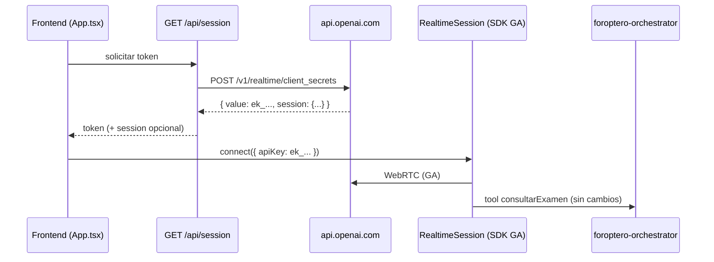

# Plan de implementación — Migración Realtime API Beta → GA

**Versión:** 0.3  
**Fecha:** 2026-05-15  
**Estado:** Implementado (pendiente verificación manual Connect + E2E Railway)  
**Relacionado con:** [DISENO_AGENTE_INTERMEDIO.md](./DISENO_AGENTE_INTERMEDIO.md) §8 (Agente de voz), error `beta_api_shape_disabled`

---

## Tabla de contenidos

1. [Resumen ejecutivo](#1-resumen-ejecutivo)
2. [Problema y causa raíz](#2-problema-y-causa-raíz)
3. [Alcance](#3-alcance)
4. [Decisiones pendientes](#4-decisiones-pendientes)
5. [Arquitectura objetivo](#5-arquitectura-objetivo)
6. [Inventario de cambios por archivo](#6-inventario-de-cambios-por-archivo)
7. [Mapa Beta → GA](#7-mapa-beta--ga)
8. [Fases de implementación](#8-fases-de-implementación)
9. [PRs sugeridos](#9-prs-sugeridos)
10. [Criterios de aceptación y pruebas](#10-criterios-de-aceptación-y-pruebas)
11. [Riesgos y mitigaciones](#11-riesgos-y-mitigaciones)
12. [Referencias](#12-referencias)

---

## 1. Resumen ejecutivo

El frontend (**Oftalmólogo AI**) no puede conectar a OpenAI Realtime porque el stack actual usa la **interfaz beta** de la API, **deshabilitada por OpenAI el 12 de mayo de 2026**. El síntoma visible (`error.no_ephemeral_key`) es secundario: la ruta `/api/session` recibe un error de OpenAI y el cliente no encuentra `client_secret.value`.

La migración requiere **tres capas**:

| Capa | Acción principal |
|------|------------------|
| **Backend (Next.js)** | Reemplazar `POST /v1/realtime/sessions` por `POST /v1/realtime/client_secrets` con forma de sesión GA |
| **Dependencias** | Actualizar `@openai/agents` de **0.0.5** a **≥ 0.1.0** (recomendado **0.11.x**); posible salto a **Zod v4** |
| **Frontend (runtime)** | Adaptar lectura del token, eventos de transcript y `session.update` (VAD / PTT) al contrato GA |

El **orquestador** (`reference/foroptero-orchestrator/`) y la tool `consultarExamen` **no requieren cambios** para esta migración.

**Esfuerzo orientativo:** 1–2 días de desarrollo + pruebas E2E con orquestador.

---

## 2. Problema y causa raíz

### 2.1 Síntoma

Al pulsar **Connect**, los logs muestran:

1. `fetch_session_token_request`
2. `fetch_session_token_response` con JSON de error OpenAI
3. `error.no_ephemeral_key` (rojo)

```json
{
  "error": {
    "message": "The Realtime Beta API is no longer supported. Please use /v1/realtime for the GA API.",
    "type": "invalid_request_error",
    "code": "beta_api_shape_disabled"
  }
}
```

### 2.2 Cadena causal

```
App.tsx (Connect)
  → GET /api/session
    → POST https://api.openai.com/v1/realtime/sessions  [contrato beta]
      → OpenAI: beta_api_shape_disabled
    → respuesta sin client_secret
  → App.tsx: error.no_ephemeral_key
  → (nunca llega RealtimeSession.connect)
```

### 2.3 Causa raíz

Integración basada en el demo [openai-realtime-agents](https://github.com/openai/openai-realtime-agents) con `@openai/agents@0.0.5`, anterior a la migración GA del SDK (changelog **0.1.0**: *"moving realtime to the new GA API"*).

---

## 3. Alcance

### 3.1 Incluido

| Componente | Cambio |
|------------|--------|
| `src/app/api/session/route.ts` | Endpoint y body GA para `client_secrets` |
| `src/app/App.tsx` | Lectura de token, manejo de errores, `session.update` |
| `src/app/hooks/useRealtimeSession.ts` | Config de sesión y eventos de transporte GA |
| `package.json` / lock | Upgrade `@openai/agents`, posible Zod 4 |
| Pruebas manuales | Connect, voz, PTT, tool, orquestador |
| Este documento | Actualizar estado al cerrar fases |

### 3.2 Excluido

| Componente | Motivo |
|------------|--------|
| `reference/foroptero-orchestrator/*` | No usa Realtime; HTTP/MQTT independiente |
| `src/app/agentConfigs/guardrails.ts` | Usa Responses API (`/api/responses`) |
| `reference/foroptero-server/` | Legado, no en PoC activa |
| Cambios de protocolo clínico / prompts del orquestador | Fuera del alcance técnico |
| Migración a `gpt-realtime-2` / reasoning | Opcional post-GA |

---

## 4. Decisiones

### 4.1 Acordadas (2026-05-15)

| ID | Decisión |
|----|----------|
| **D1** | Mantener **`gpt-realtime-mini-2025-12-15`** |
| **D2** | **`@openai/agents@0.11.x`** (recomendado; ver §4.2) |
| **D3** | **Zod 4** junto con el upgrade del SDK (recomendado; ver §4.2) |
| **D4** | **Híbrido (C)** — igual que hoy: token en servidor, agente/tools en SDK (ver §4.3) |
| **D5** | Mantener voz **`alloy`** |
| **D6** | **`server_vad`** — mismo comportamiento que hoy (ver §4.4) |
| **D7** | **600 s** (default del plan; no discutido) |
| **D8** | **Solo logs** — sin toast/banner nuevo en UI |
| **D9** | **No implementar** — no existía en el proyecto (ver §4.5) |
| **D10** | Orquestador E2E: **`https://oftalmagentv2-production.up.railway.app`** (`NEXT_PUBLIC_FOROPTERO_ORCHESTRATOR_URL`) |

### 4.2 D2–D3: SDK y Zod (por qué 0.11.x + Zod 4)

**Qué es cada cosa**

- **D2 (`@openai/agents`)**: librería que conecta el navegador por WebRTC, envía eventos (`session.update`, PTT) y ejecuta tools. La versión **0.0.5** solo habla **beta**; desde **0.1.0** el mismo paquete usa la API **GA**.
- **D3 (Zod)**: validación de schemas (p. ej. salida del guardrail en `guardrails.ts`). El SDK **≥ 0.4** pide **Zod 4**; el repo hoy tiene **Zod 3.24**.

**Impacto si elegís 0.11.x + Zod 4 (recomendado)**

| Área | Impacto |
|------|---------|
| Realtime / Connect | Necesario para que funcione GA; es el objetivo de la migración |
| `guardrails.ts` | Posible ajuste menor de imports/API de Zod 4 (`zodTextFormat`, etc.) |
| `package.json` | Un `npm install` y revisar `npm run build` |
| Comportamiento clínico / orquestador | **Ninguno** |

**Alternativa (no recomendada):** SDK **0.3.x** + Zod 3 — menos cambios en guardrails, pero versión más vieja, menos fixes GA y deuda técnica inmediata.

**Recomendación:** **D2 = 0.11.x**, **D3 = Zod 4**. Es el camino estándar de OpenAI; el costo extra es acotado al build/guardrails, no al flujo de examen.

### 4.3 D4: dónde se configura la sesión (qué cambia respecto a “cuando funcionaba”)

Hoy, **antes del corte beta**, la config estaba repartida así (y **se mantiene**):

| Qué | Dónde hoy | Después de migrar |
|-----|-----------|-------------------|
| Modelo | `session/route.ts` + `useRealtimeSession` | Igual; el servidor GA envía `model` en `client_secrets` |
| Instrucciones del oftalmólogo | `chatSupervisor/index.ts` (`RealtimeAgent`) | Igual — SDK |
| Tool `consultarExamen` | `chatSupervisor/index.ts` | Igual — SDK |
| Voz `alloy` | `RealtimeAgent.voice` | Igual; opcional duplicar en `client_secrets` solo si hace falta |
| VAD / PTT (`server_vad`, threshold 0.9) | `App.tsx` → `session.update` | **Misma lógica**, pero el JSON va bajo `audio.input.turn_detection` (forma GA) |
| Transcripción entrada | `useRealtimeSession` `inputAudioTranscription` | Mismo rol; nombre de campo según SDK GA |

**Qué NO cambia para vos como usuario del sistema:** quién habla, cuándo corta el micrófono, qué dice el agente, llamadas al orquestador.

**Qué SÍ cambia (solo técnico):** el endpoint del token (`client_secrets`) y la **forma** del JSON en `session.update`; no el diseño “servidor emite token + agente en frontend”.

**Decisión D4 = C (híbrido)** porque replica exactamente el demo que ya tenían funcionando.

### 4.4 D6: `server_vad` vs `semantic_vad`

| | **server_vad** (actual) | **semantic_vad** |
|---|-------------------------|------------------|
| Criterio de fin de turno | Silencio ~500 ms (volumen) | Modelo interpreta si el usuario “terminó de pensar” |
| Sensación | Predecible, como un walkie-talkie | Más natural en frases largas o “ehhh…” |
| Riesgo | Corta si el paciente hace pausa larga | Puede esperar más; un poco más de latencia |
| En vuestro código | `App.tsx` `updateSession` con `threshold: 0.9`, `silence_duration_ms: 500` | Habría que reconfigurar y re-probar todo el examen |

**Recomendación:** **`server_vad`** — es lo que ya tenían calibrado; **semantic_vad** sería un experimento de UX, no parte obligatoria de la migración GA.

### 4.5 D9: `OpenAI-Safety-Identifier`

**No lo tenían.** No hay ningún header ni campo con ese nombre en el repo.

Es un header **opcional** que OpenAI recomienda en producción para asociar abusos a un usuario concreto (p. ej. hash del ID de operador), sin enviar la API key al navegador. No afecta audio, tools ni orquestador.

**Decisión:** no implementar en esta migración. Revisar más adelante si DigiFAB lo exige en políticas de despliegue.

### 4.6 D10: entorno E2E

- **URL producción orquestador:** `https://oftalmagentv2-production.up.railway.app`
- Variable frontend: `NEXT_PUBLIC_FOROPTERO_ORCHESTRATOR_URL=https://oftalmagentv2-production.up.railway.app`
- Pruebas T6/T11 del §10: tool `consultarExamen` contra ese host (CORS del orquestador debe permitir el origen del frontend).

---

## 5. Arquitectura objetivo

### 5.1 Flujo de autenticación y conexión (GA)



### 5.2 Separación de responsabilidades (sin cambios de negocio)

| Rol | Componente | Protocolo |
|-----|------------|-----------|
| Agente de voz | `chatSupervisor` + SDK Realtime | WebRTC + events GA |
| Agente intermedio | `foroptero-orchestrator` | `POST /api/examen/turno` |
| Dispositivos | MQTT vía orquestador | Sin cambio |

---

## 6. Inventario de cambios por archivo

### 6.1 Crítico — bloquea Connect

#### `src/app/api/session/route.ts`

| Actual (beta) | Objetivo (GA) |
|---------------|---------------|
| `POST …/v1/realtime/sessions` | `POST …/v1/realtime/client_secrets` |
| Body: `{ model }` | Body: `{ expires_after?, session: { type: "realtime", model, audio, … } }` |
| Devuelve JSON OpenAI tal cual | Propagar `response.status`; no devolver 200 con `{ error }` |
| Sin header beta | **No** enviar `OpenAI-Beta: realtime=v1` |

**Ejemplo de body GA** (valores sujetos a D1, D4–D7):

```json
{
  "expires_after": {
    "anchor": "created_at",
    "seconds": 600
  },
  "session": {
    "type": "realtime",
    "model": "gpt-realtime-mini-2025-12-15",
    "output_modalities": ["audio"],
    "audio": {
      "input": {
        "transcription": { "model": "gpt-4o-mini-transcribe" },
        "turn_detection": {
          "type": "server_vad",
          "threshold": 0.9,
          "prefix_padding_ms": 300,
          "silence_duration_ms": 500,
          "create_response": true
        }
      },
      "output": { "voice": "alloy" }
    }
  }
}
```

#### `src/app/App.tsx` — `fetchEphemeralKey`

| Actual | Objetivo |
|--------|----------|
| `data.client_secret?.value` | `data.value` (prefijo `ek_`) |
| Log `error.no_ephemeral_key` genérico | Si `data.error`, loguear `code` + `message`; opcional UI (D8) |

### 6.2 Alto — runtime voz

#### `package.json`

```json
"@openai/agents": "^0.11.4"
```

- Revisar peer de **Zod** según D3.
- Ejecutar `npm install` y `npm run build`.

#### `src/app/hooks/useRealtimeSession.ts`

| Área | Acción |
|------|--------|
| `RealtimeSession` / `OpenAIRealtimeWebRTC` | Verificar API post-upgrade; mantener `changePeerConnection` para codec |
| `config.inputAudioTranscription` | Alinear con forma GA del SDK (`audio.input.transcription`) |
| Eventos transport | Añadir/renombrar handlers según tabla §7 |
| PTT (`input_audio_buffer.*`, `response.create`) | Validar contra SDK 0.11; ajustar si el SDK expone helpers |

#### `src/app/App.tsx` — `updateSession`

Mover `turn_detection` a la ruta GA:

```ts
// Beta (actual)
session: { turn_detection: turnDetection }

// GA (objetivo)
session: {
  audio: {
    input: { turn_detection: turnDetection }
  }
}
```

Comportamiento esperado:

| Modo UI | `turn_detection` |
|---------|------------------|
| VAD (checkbox “Hablar” desactivado) | `server_vad` + `create_response: true` |
| PTT (“Hablar” activo) | `null` |

### 6.3 Bajo — revisión post-migración

| Archivo | Acción |
|---------|--------|
| `src/app/agentConfigs/chatSupervisor/index.ts` | Confirmar que `voice` en `RealtimeAgent` no duplica/conflicta con D4; tool `consultarExamen` sin cambios |
| `src/app/hooks/useHandleSessionHistory.ts` | Probar transcript; ajustar si cambian payloads de `history_*` |
| `src/app/lib/codecUtils.ts` | Regresión con `?codec=opus|pcmu|pcma` |
| `README.md` | Nota: requiere Realtime GA + versiones mínimas SDK |

---

## 7. Mapa Beta → GA

| Concepto | Beta (actual) | GA (objetivo) |
|----------|---------------|---------------|
| Endpoint token | `POST /v1/realtime/sessions` | `POST /v1/realtime/client_secrets` |
| Token en respuesta | `client_secret.value` | `value` (`ek_…`) |
| Header | `OpenAI-Beta: realtime=v1` (implícito en contrato antiguo) | No usar |
| Modalidades salida | `modalities` | `output_modalities` |
| Límite tokens respuesta | `max_response_output_tokens` | `max_output_tokens` |
| VAD / transcripción | campos planos en `session` | `session.audio.input.*` |
| Voz | `voice` en agente o sesión plana | `session.audio.output.voice` |
| Tipo sesión | implícito | `session.type: "realtime"` obligatorio |
| Transcript asistente (evento) | `response.audio_transcript.delta` / `.done` | `response.output_audio_transcript.delta` (y equivalentes) |
| Transcript usuario | `conversation.item.input_audio_transcription.completed` | Verificar en [referencia eventos](https://developers.openai.com/api/docs/api-reference/realtime_client_events) |
| SDK mínimo GA | `@openai/agents@0.0.5` | `@openai/agents@≥0.1.0` |

---

## 8. Fases de implementación

### Fase 0 — Preparación

**Entregables**

- [ ] Decisiones §4 cerradas (o “usar recomendaciones”).
- [ ] `OPENAI_API_KEY` con acceso Realtime GA verificado.
- [ ] Orquestador accesible en `NEXT_PUBLIC_FOROPTERO_ORCHESTRATOR_URL`.
- [ ] Baseline de logs guardado (error actual documentado).

**Comandos de verificación (manual)**

```bash
# Tras implementar Fase 1 — debe devolver value ek_...
curl -s http://localhost:3000/api/session | jq .
```

---

### Fase 1 — Token efímero (backend)

**Objetivo:** `/api/session` devuelve `value` válido sin `beta_api_shape_disabled`.

**Tareas**

1. Cambiar URL y body en `src/app/api/session/route.ts` (§6.1).
2. Actualizar `fetchEphemeralKey` en `App.tsx` para leer `data.value`.
3. Propagar status HTTP de OpenAI al cliente.
4. (Opcional D8) Mostrar error en UI si falla.

**Criterio de salida:** `curl /api/session` → `"value": "ek_..."` y Connect ya no muestra `beta_api_shape_disabled`.

> **Nota:** Con SDK 0.0.5, Connect puede seguir fallando en WebRTC hasta Fase 2.

---

### Fase 2 — Upgrade SDK y dependencias

**Objetivo:** Cliente compatible con API y eventos GA.

**Tareas**

1. Actualizar `@openai/agents` según D2.
2. Resolver Zod según D3 (`npm run build`).
3. Corregir errores de tipos en imports `@openai/agents/realtime`.
4. Revisar breaking changes en [CHANGELOG agents-realtime](https://github.com/openai/openai-agents-js/blob/main/packages/agents-realtime/CHANGELOG.md).

**Criterio de salida:** `npm run build` sin errores; proyecto arranca con `npm run dev`.

---

### Fase 3 — Runtime frontend (eventos y sesión)

**Objetivo:** Audio, transcript, PTT y `session.update` operativos.

**Tareas**

1. Actualizar handlers en `useRealtimeSession.ts` (§7).
2. Migrar `updateSession` en `App.tsx` a forma `audio.input.turn_detection` (§6.2).
3. Probar `sendUserText` / mensaje simulado `conversation.item.create`.
4. Regresión codec `?codec=`.

**Criterio de salida:** Connect → CONNECTED; se escucha al agente; transcript de usuario y asistente en panel Conversación.

---

### Fase 4 — Integración con orquestador

**Objetivo:** Flujo clínico PoC intacto.

**Tareas**

1. Connect → agente llama `consultarExamen` al inicio.
2. Verificar logs `function call` / respuesta en panel.
3. E2E con orquestador: al menos un turno `esperar_respuesta` con respuesta simulada del paciente.

**Criterio de salida:** Orquestador recibe `POST /api/examen/turno`; mensajes del turno se pronuncian según `pasos[].mensaje`.

---

### Fase 5 — Cierre y documentación

**Tareas**

1. Ejecutar checklist §10 completo.
2. Actualizar **Estado** de este documento a *Implementado*.
3. Añadir nota breve en `README.md` (requisito GA, versión SDK).

---

## 9. PRs sugeridos

| PR | Contenido | Depende de |
|----|-----------|------------|
| **PR1** | Fase 1 — `session/route.ts` + `fetchEphemeralKey` + errores HTTP | Fase 0 |
| **PR2** | Fase 2 — `package.json`, Zod, build | PR1 (puede combinarse) |
| **PR3** | Fase 3 — `useRealtimeSession`, `updateSession`, eventos | PR2 |
| **PR4** | Fase 4–5 — pruebas E2E, README, estado doc | PR3 |

**Mínimo viable para demo:** PR1 + PR2 + PR3 en un solo branch si el equipo prefiere un único merge.

---

## 10. Criterios de aceptación y pruebas

### 10.1 Checklist funcional

| # | Prueba | Pasos | Éxito |
|---|--------|-------|-------|
| T1 | Token | `curl /api/session` o Connect | `value` con prefijo `ek_`; sin `beta_api_shape_disabled` |
| T2 | Conexión | Connect en UI | Estado CONNECTED; sin `error.no_ephemeral_key` |
| T3 | Saludo | Tras connect (VAD o mensaje inicial) | Audio del agente audible |
| T4 | Transcript usuario | Hablar al micrófono | Texto en panel Conversación |
| T5 | Transcript asistente | Respuesta del agente | Texto actualizado (eventos GA) |
| T6 | Tool | Inicio de sesión | `consultarExamen` en logs; HTTP al orquestador |
| T7 | PTT | Activar “Hablar”, pulsar, hablar, soltar | Una respuesta del agente por turno |
| T8 | VAD toggle | Desactivar PTT | VAD responde al final del habla |
| T9 | Codec | `?codec=pcmu` + reload + Connect | Conexión estable (regresión) |
| T10 | Guardrail | Respuesta que dispare moderación | Chip / breadcrumb guardrail (si aplica) |
| T11 | E2E examen | Flujo agudeza con orquestador | Al menos OD: un turno completo con dispositivos o mock |

### 10.2 Entornos

| Entorno | Frontend | Orquestador | Notas |
|---------|----------|-------------|-------|
| Local dev | `npm run dev` (:3000) | Local `:3001` **o** Railway (D10) | Para E2E clínico usar Railway acordado |
| Producción / E2E | Despliegue frontend | `https://oftalmagentv2-production.up.railway.app` | `NEXT_PUBLIC_FOROPTERO_ORCHESTRATOR_URL` |

---

## 11. Riesgos y mitigaciones

| Riesgo | Probabilidad | Impacto | Mitigación |
|--------|--------------|---------|------------|
| Salto Zod 3 → 4 rompe guardrails/schemas | Media | Alto | D3; probar `runGuardrailClassifier` tras upgrade |
| Eventos renombrados → transcript vacío | Media | Medio | Tabla §7; probar T4–T5 antes de E2E |
| `session.update` beta → transcript/PTT roto | Media | Alto | Probar T7–T8 explícitamente |
| Solo PR1 sin PR2 → Connect parcial | Alta | Alto | No cerrar migración sin Fase 2 |
| Modelo D1 no disponible en cuenta | Baja | Alto | Verificar en dashboard OpenAI antes de Fase 1 |
| Duplicar config voz/VAD (D4) servidor + SDK | Media | Bajo | Documentar fuente única; preferir servidor para VAD/voz |

---

## 12. Referencias

| Recurso | URL |
|---------|-----|
| Migración Beta → GA | https://developers.openai.com/api/docs/guides/realtime#beta-to-ga-migration |
| Create client secret | https://developers.openai.com/api/docs/api-reference/realtime-sessions/create-realtime-client-secret |
| Voice agents | https://developers.openai.com/api/docs/guides/voice-agents |
| Realtime WebRTC | https://developers.openai.com/api/docs/guides/realtime-webrtc |
| Changelog deprecación (12-may-2026) | https://developers.openai.com/api/docs/changelog |
| SDK agents-realtime CHANGELOG | https://github.com/openai/openai-agents-js/blob/main/packages/agents-realtime/CHANGELOG.md |
| Demo origen (beta) | https://github.com/openai/openai-realtime-agents |
| Diseño PoC (este repo) | [DISENO_AGENTE_INTERMEDIO.md](./DISENO_AGENTE_INTERMEDIO.md) |

---

## Historial de revisiones

| Versión | Fecha | Autor | Cambios |
|---------|-------|-------|---------|
| 0.1 | 2026-05-15 | — | Borrador inicial tras análisis de causa raíz |
| 0.2 | 2026-05-15 | — | Decisiones D1–D10 cerradas; §4.2–4.6 con aclaraciones |
| 0.3 | 2026-05-15 | — | Migración código: client_secrets, SDK 0.11.4, Zod 4, openai 6.x |

### Registro de implementación (v0.3)

| Archivo | Cambio |
|---------|--------|
| `package.json` | `@openai/agents@^0.11.4`, `zod@^4`, `openai@^6.37.0` |
| `src/app/api/session/route.ts` | `POST /v1/realtime/client_secrets`, sesión GA, status HTTP propagado |
| `src/app/App.tsx` | Token `data.value`, errores `data.error`, `session.update` con `audio.input` |
| `src/app/hooks/useRealtimeSession.ts` | Config `audio.input.transcription`, eventos `response.output_audio_transcript.*` |
